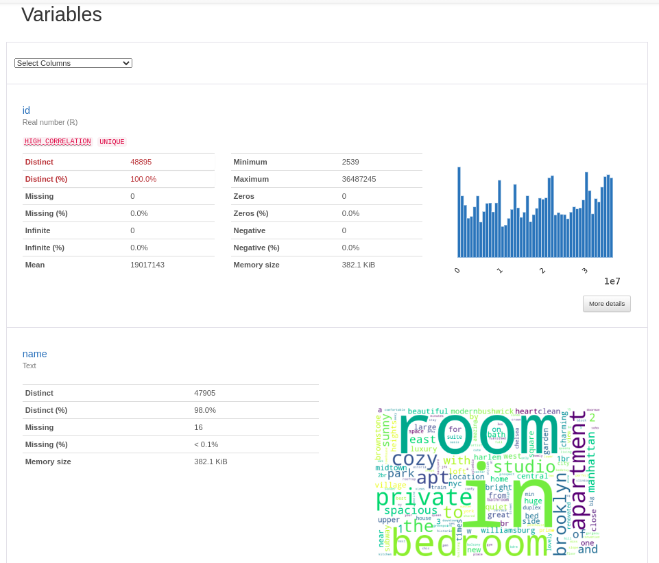

# Build an ML Pipeline for Short-Term Rental Prices in NYC
This project was built for a property management company renting rooms and properties for short periods of 
time on various rental platforms. 
Our model allows estimating the typical price for a given property based 
on the price of similar properties. 
We receive new data in bulk every week. The model needs 
to be retrained with the same cadence, necessitating an end-to-end pipeline that can be reused.

In this project we built such a pipeline.

## Table of contents

- [Preliminary steps](#preliminary-steps)
  * [Fork the Starter Kit](#fork-the-starter-kit)
  * [Create environment](#create-environment)
  * [Get API key for Weights and Biases](#get-api-key-for-weights-and-biases)
  * [The configuration](#the-configuration)
  * [Running the entire pipeline or just a selection of steps](#Running-the-entire-pipeline-or-just-a-selection-of-steps)
- [Instructions](#instructions)
  * [Exploratory Data Analysis (EDA)](#exploratory-data-analysis-eda)
  * [Data cleaning](#data-cleaning)
  * [Data testing](#data-testing)
  * [Data splitting](#data-splitting)
  * [Train Random Forest](#train-random-forest)
  * [Optimize hyperparameters](#optimize-hyperparameters)
  * [Select the best model](#select-the-best-model)
  * [Test](#test)
  * [Visualize the pipeline](#visualize-the-pipeline)
  * [Release the pipeline](#release-the-pipeline)
  * [Train the model on a new data sample](#train-the-model-on-a-new-data-sample)

## Preliminary steps
### Fork the Starter kit
Go to [https://github.com/KaoutherBouzouita/build-ml-pipeline-for-short-term-rental-prices](https://github.com/KaoutherBouzouita/build-ml-pipeline-for-short-term-rental-prices).

Now clone the repository locally, so you can start working on it:

```
https://github.com/KaoutherBouzouita/build-ml-pipeline-for-short-term-rental-prices
```

### Create environment
Make sure to have conda installed and ready, then create a new environment using the ``environment.yml``
file provided in the root of the repository and activate it:

```bash
> conda env create -f environment.yml
> conda activate nyc_airbnb_dev
```

### Get API key for Weights and Biases
Let's make sure we are logged in to Weights & Biases. Get your API key from W&B by going to 
[https://wandb.ai/authorize](https://wandb.ai/authorize) and click on the + icon (copy to clipboard), 
then paste your key into this command:

```bash
> wandb login [your API key]
```

You should see a message similar to:
```
wandb: Appending key for api.wandb.ai to your netrc file: /home/[your username]/.netrc
```

### The configuration
As usual, the parameters controlling the pipeline are defined in the ``config.yaml`` file defined in
the root of the project. This file is only read by the ``main.py`` script 
(i.e., the pipeline) and its content is
available with the ``go`` function in ``main.py`` as the ``config`` dictionary. For example,
the name of the project is contained in the ``project_name`` key under the ``main`` section in
the configuration file. It can be accessed from the ``go`` function as 
``config["main"]["project_name"]``.

### Running the entire pipeline or just a selection of steps
In order to run the pipeline when you are developing, you need to be in the root of the project, 
then you can execute as usual:

```bash
>  mlflow run .
```
This will run the entire pipeline.

When developing it is useful to be able to run one step at the time. Say you want to run only
the ``download`` step. The `main.py` is written so that the steps are defined at the top of the file, in the 
``_steps`` list, and can be selected by using the `steps` parameter on the command line:

```bash
> mlflow run . -P steps=download
```
If you want to run the ``download`` and the ``basic_cleaning`` steps, you can similarly do:
```bash
> mlflow run . -P steps=download,basic_cleaning
```
You can override any other parameter in the configuration file using the Hydra syntax, by
providing it as a ``hydra_options`` parameter. For example, say that we want to set the parameter
modeling -> random_forest -> n_estimators to 10 and etl->min_price to 50:

```bash
> mlflow run . \
  -P steps=download,basic_cleaning \
  -P hydra_options="modeling.random_forest.n_estimators=10 etl.min_price=50"
```

## Instructions

The pipeline is defined in the ``main.py`` file in the root of the project.

### Exploratory Data Analysis (EDA)
The scope of this section is to get an idea of how the process of an EDA works in the context of
pipelines, during the data exploration phase.

1. The ``main.py`` script contains a download data step. Run the pipeline to 
   get a sample of the data. The pipeline will also upload it to Weights & Biases:
   
  ```bash
  > mlflow run . -P steps=download
  ```
  
  You will see a message similar to:

  ```
  2021-03-12 15:44:39,840 Uploading sample.csv to Weights & Biases
  ```
  This tells you that the data is going to be stored in W&B as the artifact named ``sample.csv``.

  In Weights & Biases, you can see the raw data downloaded by the pipeline:


2. Now execute the `eda` step:
   ```bash
   > mlflow run src/eda
   ```
   This will install Jupyter and all the dependencies for `pandas-profiling`, and open a Jupyter notebook instance.
   Click on the ``EDA.ipynb`` notebook.

   

3. Within the notebook, we fetched the artifact created (``sample.csv``) from W&B and read 
   it with pandas:
    
    ```python
    import wandb
    import pandas as pd
    
    run = wandb.init(project="nyc_airbnb", group="eda", save_code=True)
    local_path = wandb.use_artifact("sample.csv:latest").file()
    df = pd.read_csv(local_path)
    ```
    Note that we use ``save_code=True`` in the call to ``wandb.init`` so the notebook is uploaded and versioned
    by W&B.

4. Using `ydata-profiling`, we created a profile:
   ```python
   import ydata_profiling
   profile = ydata_profiling.ProfileReport(df)
   profile.to_widgets()
   ```
   Data analysis is made easier using such a report. It provides:
* Overview

   
* Variables


* Correlations

   
* Missing Values

   

and many other statistics.

## Data cleaning

Now we transfer the data processing we have done as part of the EDA to a new ``basic_cleaning`` 
step that starts from the ``sample.csv`` artifact and create a new artifact ``clean_sample.csv`` 
with the cleaned data:

1. Make sure you are in the root directory of the project. The new step should accept the parameters ``input_artifact`` 
   (the input artifact), ``output_artifact`` (the name for the output artifact), 
   ``output_type`` (the type for the output artifact), ``output_description`` 
   (a description for the output artifact), ``min_price`` (the minimum price to consider)
   and ``max_price`` (the maximum price to consider):
   
2. Run the pipeline. If you go to W&B, you will see the new artifact type `clean_sample` and within it the 
   `clean_sample.csv` artifact.

 

### Data testing
After the cleaning, it is a good practice to put some tests that verify that the data does not
contain surprises. 

One of our tests will compare the distribution of the current data sample with a reference, 
to ensure that there is no unexpected change. Therefore, we defined a 
"reference dataset". The latest ``clean_sample.csv`` artifact is tagged W&B as our 
reference dataset.
 
Now we are ready to add some tests. In the starter kit you can find a ``data_tests`` step.
  
which checks that the size of the dataset is reasonable (not too small, not too large).

Run the pipeline and make sure the tests are executed and that they pass. You can run just this
step with:

```bash
> mlflow run . -P steps="data_check"
```

You can safely ignore the following DeprecationWarning if you see it:

```
DeprecationWarning: Using or importing the ABCs from 'collections' instead of from 'collections.abc' 
is deprecated since Python 3.3, and in 3.10 it will stop working
```
Logs of data checks can be checked in W&B, under ``Logs`` tag:


### Data splitting
The component ``train_val_test_split`` extracts and segregates the test set. 
Run the pipeline. As usual, use the configuration for the parameters like `test_size`,
`random_seed` and `stratify_by`. Look at the `modeling` section in the config file.

After you execute, you will see something like:

```
2021-03-15 01:36:44,818 Uploading trainval_data.csv dataset
2021-03-15 01:36:47,958 Uploading test_data.csv dataset
```
in the log. This tells you that the script is uploading 2 new datasets: ``trainval_data.csv`` and ``test_data.csv``.

### Train Random Forest

Run the pipeline, using the ``train_random_forest`` step:

```bash
> mlflow run . -P steps="train_random_forest"
```

### Optimize hyperparameters
Re-run the entire pipeline varying the hyperparameters of the Random Forest model. This can be
accomplished easily by exploiting the Hydra configuration system. Use the multi-run feature (adding the `-m` option 
at the end of the `hydra_options` specification), and try setting the parameter `modeling.max_tfidf_features` to 10, 15
and 30, and the `modeling.random_forest.max_features` to 0.1, 0.33, 0.5, 0.75, 1.

HINT: if you don't remember the hydra syntax, you can take inspiration from this is example, where we vary 
two other parameters (this is NOT the solution to this step):
```bash
> mlflow run . \
  -P steps=train_random_forest \
  -P hydra_options="modeling.random_forest.max_depth=10,50,100 modeling.random_forest.n_estimators=100,200,500 -m"
```
you can change this command line to accomplish your task.

### Select the best model
Go to W&B and select the best performing model. We are going to consider the Mean Absolute Error as our target metric,
so we are going to choose the model with the lowest MAE.


In the artifact section, the ``prod`` can be added to the job having released the best  
`model_export` output artifact, to mark it as "production ready".

### Test
Use the provided step ``test_regression_model`` to test your production model against the
test set. Implement the call to this component in the `main.py` file. The artifact `random_forest_export:prod` 
is used for the parameter `mlflow_model` and the test artifact `test_data.csv:latest` is used for `test_artifact`.

**NOTE**: This step is NOT run by default when you run the pipeline. In fact, it needs the manual step
of promoting a model to ``prod`` before it can complete successfully. Therefore, you have to
activate it explicitly on the command line:

```bash
> mlflow run . -P steps=test_regression_model
```

### Visualize the pipeline
You can now go to W&B, go the Artifacts section, select the model export artifact then click on the
``Graph view`` tab. You will see a representation of your pipeline.


### Release the pipeline
The best hyper parameters found were copied in ``config.yaml`` file. 
In the repository on GitHub a release has been made, called ``1.0.0``:


Other releases were made to fix some bugs, to add additional features ``1.0.1``, ``1.1.0`` and the last one 
``1.1.1``.


### Train the model on a new data sample

The model was trained on a new data sample that our company received (``sample2.csv``):

```bash
> mlflow run https://github.com/KaoutherBouzouita/build-ml-pipeline-for-short-term-rental-prices.git \
             -v [the version you want to use, like 1.1.1] \
             -P hydra_options="etl.sample='sample2.csv'"
```

## License

[License](LICENSE.txt)

## Link to Github Repository
https://github.com/KaoutherBouzouita/build-ml-pipeline-for-short-term-rental-prices

## Link to W&B Project
https://wandb.ai/insta-team/nyc_airbnb?workspace=user-kaouther

